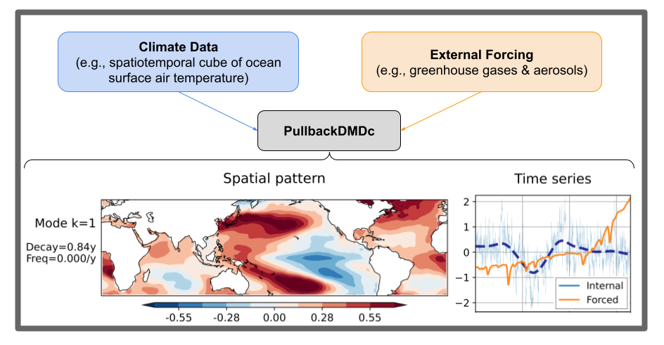

# PullbackDMDc

Pullback Dynamic Mode Decomposition with control (PullbackDMDc) decomposes spatiotemporal climate data into forced and internal variability components by fitting a linear stochastic dynamical system with external forcing and estimating its pullback attractor.



This repo contains the code used to produce paper figures from PullbackDMDc, LIM, and linear-regression baselines.

## How to Cite
```
@misc{mankovich2026pullbackdmdc,
      title={Disentangling Forced and Internal Climate Variability in Single Realizations using Dynamic Mode Decomposition with Control}, 
      author={Nathan Mankovich and Andrei Gavrilov and Gustau Camps-Valls},
      year={2026},
      eprint={2607.18298},
      archivePrefix={arXiv},
      primaryClass={stat.ML},
      url={https://arxiv.org/abs/2607.18298}, 
}
```

## Environment Setup

Create and activate the environment:

```bash
conda env create -f dmdc_variants.yml
conda activate dmdc_variants
```

If your environment name differs, use the name specified in `dmdc_variants.yml`.

## Getting Started Notebook

See `getting_started_pullbackdmdc.ipynb` for a runnable walkthrough of:
- fitting `PullbackDMDc` on synthetic data,
- obtaining forced-response estimations,
- computing rotated modes,
- and serializing a fitted model object.

The model class implementation is in `utils/pullback_dmdc.py`. For import consistency, use:

```python
from utils.pullback_dmdc import PullbackDMDc
model = PullbackDMDc(...)
```

Taylor diagram workflow details are documented in `evaluation/utils/README.md`.

## Directory Structure

- `data_preparation/`: preprocessing utilities and EOF generation used by downstream evaluation.
- `evaluation/`: scripts that compute intermediate metrics and produce paper figure files.
- `evaluation_results/`: output directory for generated plots and intermediate files.
- `utils/`: model implementations and shared data-loading logic.
- `downloads/`: dataset download and preprocessing helpers.
    - `downloads/models_gdex/`: GDEX scripts for MMLEA model members (tas/psl).
    - `downloads/obs_20cr_v3/`: NOAA PSL 20CRv3 observational downloads and regridding helper.
- `dmdc_variants.yml`: conda environment definition.


## Data Download Setup

The workflow expects data under `PBDMDC_DATA_ROOT` (defaults to `/data/databases/dmdc-variants/mmlea_v2/`).

1. Download MMLEA model ensembles:
```bash
sbatch downloads/models_gdex/run_download.slurm
```

2. Download 20CRv3 observational products:
```bash
bash downloads/obs_20cr_v3/download.sh
```

3. Regrid and format 20CRv3 to match model grid/time range:
```bash
python -m downloads/obs_20cr_v3/regrid_downloaded_data
```

See `downloads/README.md` for details and expected output layout.

## Paper-Figure Workflow

The retained figure generation path is:

1. Prepare data and EOF artifacts:
```bash
python -m data_preparation.interpolate_full_forcing
python -m data_preparation.compute_means
python -m data_preparation.compute_eofs
python -m data_preparation.create_tas_ocean
```

2. Fit models (lag-3 all-time and tier1):
```bash
python experiments.py
```

3. Compute intermediate metrics used by plotting scripts:
```bash
python -m evaluation.compute_taylor_vis
python -m evaluation.compute_trend_taylor_viz
python -m evaluation.compute_gm_timeseries
python -m evaluation.compute_acfs
```

4. Generate paper figures in `evaluation_results/`:
```bash
python -m evaluation.plot_taylor_vis
python -m evaluation.plot_gm_timeseries
python -m evaluation.plot_modes
python -m evaluation.eig_vis_circle
python -m evaluation.plot_decay_frequency
python -m evaluation.plot_mode_selection
python -m evaluation.plot_mode_summary_three_rows
python -m evaluation.plot_psd_mtm
python -m evaluation.plot_timescale_vs_forced_summary
python -m evaluation.plot_acf_summary
python -m evaluation.B_vis_small
```

Notes:
- Main scripts read data/output roots from `PBDMDC_DATA_ROOT`, `PBDMDC_ARTIFACT_ROOT`, and `PBDMDC_PDF_ROOT` (see `utils/params.py` and `slurm/*.sbatch`).
- Model/pickle-producing scripts were intentionally preserved (for example `data_preparation.compute_eofs`, `evaluation.compute_*`).

Example environment setup:
```bash
export PBDMDC_DATA_ROOT=/data/databases/dmdc-variants/mmlea_v2/
export PBDMDC_ARTIFACT_ROOT=/data/users/nate/PullbackDMDc
export PBDMDC_PDF_ROOT=/data/users/nate/PullbackDMDc/pdf
```

## Slurm Pipeline

For cluster execution, use the ordered submission wrapper:

```bash
bash slurm/submit_pipeline.sh
```

This submits:

1. `slurm/00_prepare_artifacts.sbatch`
2. `slurm/01_fit_models.sbatch`
3. `slurm/02_compute_metrics.sbatch`
4. `slurm/03_plot_main.sbatch`
5. `slurm/04_plot_tier1.sbatch`

with dependencies so fitting runs before metrics, and both plotting jobs run after metrics.


## Contacts

Nathan Mankovich <nathan.mankovich@uv.es>

Andrei Gavrilov <andrei.gavrilov@uv.es>
