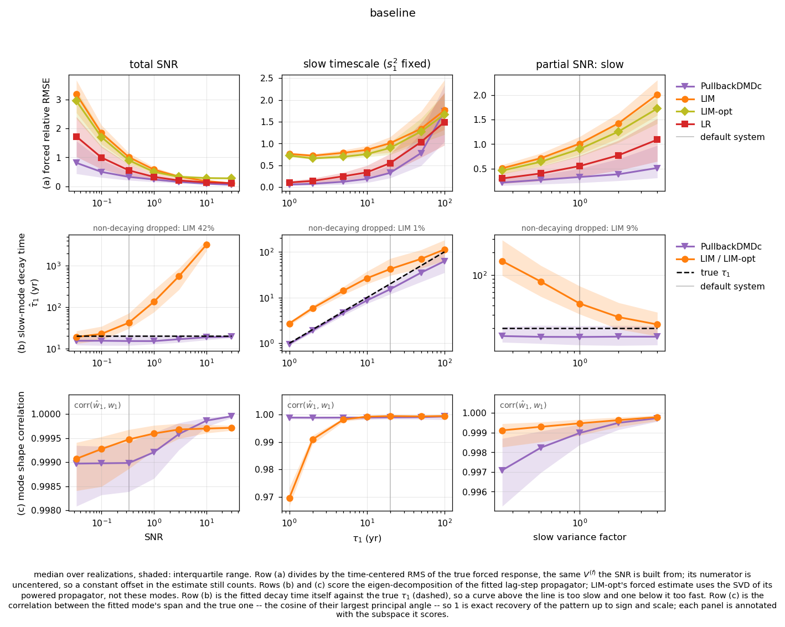
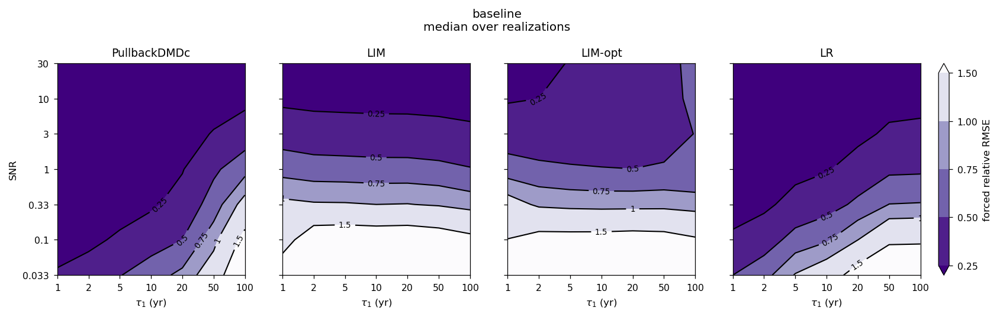
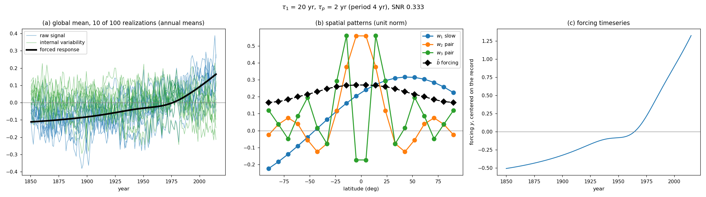
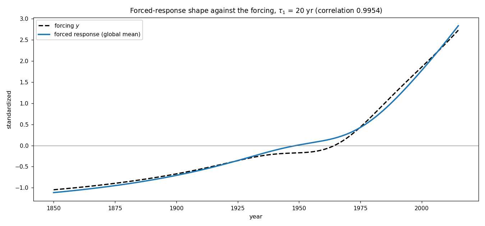

# Synthetic experiments

A 20-mode linear system — one slow mode, one oscillating pair, 17 complement modes — driven by a forcing shaped
after the AR6 CO₂ ERF. Four estimators (`PullbackDMDc`, `LIM`, `LIM-opt`, `LR`) are fitted to 100 noise
realizations at every level of every ablation study, and scored on how well they recover the forced response and
the slow mode. [Data generation](#data-generation) at the end of this file is the full specification of the system.

## Getting started

### What this package does

One synthetic climate-like system, four estimators, one question: **when can each method recover the forced
response?** The system is a 20-mode linear propagator whose slow mode is the hard part — it has the longest
memory, carries almost all of the forced variance, and is the mode a 165-year record struggles to pin down.

An *ablation study* bends one property of that system across a range of levels (`levels`), regenerates the data
at each level, refits all four methods on 100 noise realizations, and scores them. `ablations.csv` is one row
per (study, level, realization, method); the figures are summaries of it.

### Run it

```bash
./run_synthetic_experiments.sh   # every ablation run and every figure (~4 min; the fits dominate)
./run_synthetic_tests.sh         # unit tests, then the end-to-end system checks
./run_synthetic_tests.sh --list  # just list the tests
```

Both drivers activate the `dmdc_variants` conda env, `cd` into `synthetic/`, and export `OMP_NUM_THREADS=1`
(the per-step simulation loop is BLAS-thread bound — about 50× less CPU time on the cluster nodes) and
`MPLBACKEND=Agg`. Run them, rather than the scripts directly, unless you want one specific figure.

Everything runs from `synthetic/`. The folder is not a package: scripts are run from inside it.

### Change a parameter and compare

Every tunable value is a field of `Config` (`config.py`); `--set KEY=VALUE` overrides any of them, and `--name`
puts the run in its own directory so nothing existing is overwritten. Values are parsed with
`ast.literal_eval`, so lists and tuples work: `--set slow_timescales_yr=[5,20,80]`.

```bash
python run_ablation_studies.py --name slow50 --set tau1_yr=50          # a run with a 50-yr slow mode
python plot_ablation_run_results.py --runs baseline slow50             # overlay it on the baseline
```

The two-run form writes `figures/ablations/compare_baseline_vs_slow50/`, drawing the **first** run as a thin
dotted reference under the second's solid lines. `--from-run NAME` starts from a saved run's `config.json`
instead of the defaults, so `--from-run slow50 --set lag=3` varies one thing at a time.

The `Config` fields are grouped by what they control: mode timescales, the internal variance budget, the
forcing's shape in time, the seeds and forcing history, the sweep levels, and the methods.
[Every `Config` field](#every-config-field) tabulates all 33 with their defaults and the symbol each one
carries in the mathematics.

### What the figures show

| figure | read it as |
|---|---|
| `results_sweeps.png` | the headline. Three metric rows — (a) forced relative RMSE, (b) fitted $\hat\tau_1$ against the true $\tau_1$, (c) mode-shape correlation — against three studies, one per column. Lines are medians over realizations, bands are the interquartile range. |
| `results_slow_mode_shapes_<run>.png` | *where* a fitted pattern is wrong, as $\hat w_1-w_1$ against latitude. Same columns as `results_sweeps.png`, so the two stack. |
| `results_phase_snr_timescale_<run>.png` | the two axes that matter crossed: SNR against $\tau_1$, one panel per method. |
| `results_phase_change.png`, `results_forcing_change.png` | written only when exactly two runs are plotted: the phase diagram's difference, and a forcing-shape comparison. |





**Which axes actually move.** Of the eight one-dimensional studies, only two things change the scores: the **slow mode's SNR**
and **$\tau_1$**. `total_snr` and `partial_snr_slow` trace one curve (the former scales every mode's noise, the
latter only the slow mode's — and the fast modes' SNR turns out not to matter over a 900× range), while
`partial_snr_pair`, `partial_snr_complement`, `spatial_overlap` and `forcing_overlap` are flat to within the
median's sampling error (spreads of 0.004–0.020 against about ±0.03). Those four are controls, not dead
weight: the flat pair/complement columns are what establish that it is the *slow* mode's SNR doing the work.

### Reproducibility

A run is a pure function of its `config.json`: two runs of the same config produce byte-identical
`ablations.csv`. The three seeds (`pattern_seed`, `eigenvalue_seed`, `noise_seed`) and the package versions are
recorded in `provenance.json`, and `tests/test_reproducibility.py` pins the seeded draws so an RNG-stream change
cannot pass silently. One caveat: `--n-jobs 1` makes joblib fall back to a sequential backend that does not
apply `inner_max_num_threads=1`, so a serial run uses multi-threaded BLAS and can differ from a parallel run in
the last bits. Compare like with like.

## Where the results are

Every output path, and the command that writes it:

| output | written by |
|---|---|
| `results/<run>/ablations.csv`, `config.json`, `provenance.json` | `run_ablation_studies.py --name <run>` |
| `figures/ablations/<run>/results_*.png` | `plot_ablation_run_results.py --runs <run>` |
| `figures/ablations/compare_<a>_vs_<b>/results_*.png` | `plot_ablation_run_results.py --runs <a> <b>` |
| `figures/ablations/<run>/` — 3 system diagnostics | `run_ablation_studies.py` (its closing `plot_diagnostics` call) |
| `figures/diagnostics/data/` — 10 dataset diagnostics | `plot_ablation_diagnostics.py` |
| `figures/diagnostics/data/compare_forcings.png` | `plot_forcing_comparison.py` |
| `figures/diagnostics/system/<name>/` | `plot_system_diagnostics.py` |
| `figures/tests/` — 8 system checks | `tests/test_synthetic_pipeline.py` |
| `figures/reference/co2_zonal_forcing.png` | **nothing — this is an input**, the image `CO2_ZONAL_FORCING` in `system_patterns.py` was digitized from |

The headline figures are in `figures/ablations/`:

| figure | what it shows |
|---|---|
| `results_sweeps.png` | the three metrics (a)-(c) as rows, one ablation study per column, median and band over realizations, one line per method |
| `results_phase_snr_timescale_<run>.png` | the `joint_snr_timescale` study as a phase diagram: SNR against $\tau_1$, one panel per method, shaded by the forced relative RMSE with black contours labelled at `RMSE_LEVELS` |
| `results_phase_change.png` | the same phase diagram, later run minus reference (written only when exactly two runs are plotted) |
| `results_slow_mode_shapes_<run>.png` | the fitted slow mode's *departure from the truth*, $\hat w_1-w_1$, against latitude, one line per level coloured by it, grey at zero; one row per operator method, one column per study |
| `results_forcing_change.png` | two runs whose forcing differs: the forcings, their forced responses (standardized), and `PullbackDMDc` against `LR` on the `total_snr` sweep (written only when exactly two runs are plotted) |

The metric rows are fixed (`ROW_SPECS` in `plot_ablation_run_results.py`): (a) forced relative RMSE,
(b) slow-mode decay time $\hat\tau_1$ in years against the true $\tau_1$ (dashed), (c) mode shape correlation.
The columns are `DEFAULT_STUDIES` — `total_snr`, `slow_timescale_modal_variance`, `partial_snr_slow`:
the three axes the scores actually move along. The other five studies are still run and still scored into
`ablations.csv`, they are simply not default columns, and `--studies` selects any subset of `SWEEP_STUDIES`;
`--studies partial_snr_pair` is the only way row (c)'s pair-plane variant is drawn. Every column
carries a grey vertical line at its default level (`default_level`), the starting point the whole run is
built on, so a curve reads as a departure from the default rather than as an unanchored sweep. With several
runs the line is the *reference* run's default.

The phase figures score one quantity, the forced relative RMSE: the shading and the labelled black contours
are the same levels, so a panel is its own key. The levels are absolute, so one contour means the same error
in every panel and panels from different runs can be read against each other. A floor set by the finite
forcing history is folded into them, but it is machine noise ($\sim10^{-13}$) now that the history scales
with $\tau_1$, so a contour is the method's own error and nothing else.

Row (a) is $\operatorname{rms}(\hat x^{(f)}-x^{(f)})/\operatorname{rms}_c(x^{(f)})$ (`score`, `centered_rms` in
`run_ablation_studies.py`). The **denominator is centered over time**, $\operatorname{rms}_c(x^{(f)})=\sqrt{V^{(f)}/M}$,
so it is the same $V^{(f)}$ the SNR is built from; the **numerator is not**, so a constant offset in the estimate is
still charged to it. An uncentered denominator would instead carry the forced response's own offset, which grows with
$\tau_1$ and would deflate the score by $1.11$ at $\tau_1=20$ yr and $2.53$ at $100$ yr — turning a growing offset
into an apparent gain in skill.

Row (b) plots the estimate itself, so a curve above the dashed truth is too slow and one below it too fast. A fit
whose slow eigenvalue does not decay has no decay time at all: it is dropped and its share is printed above the
panels (`unstable_note`). Row (c) is the cosine of the largest principal angle between the fitted mode's span and
the true one (`subspace_corr` in `run_ablation_studies.py`), so 1 is exact recovery of the pattern up to sign and
scale; `PAIR_STUDIES` score the plane of the oscillating pair, every other study the slow mode, and each panel is
annotated with the one it scores.

The 3 system diagnostics that accompany each run — `modal_overview`, `forced_response_ablations`,
`forced_response_shape` (`RUN_DIAGNOSTICS` in `run_ablation_studies.py`) — show the *data*, not the fits.
`forcing` and `ensemble_super_spaghetti` are not among them: they describe the forcing and the noise
realizations, which follow from the config alone and are therefore identical in every run that shares one.
`plot_system_diagnostics.py` still writes all five into `figures/diagnostics/system/<name>/`.

### Figure directory names

- `figures/ablations/`: one run goes to `<run>`, several to `compare_<a>_vs_<b>[_vs_...]`. With several runs
  the first is the reference, drawn as thin dotted medians under the others.
- `figures/diagnostics/system/<name>/`: `<name>` is `--name` if given, else `--from-run`, else `config.slug(cfg)`
  — `default` when the config is the default, otherwise a sanitized `config_diff` such as `n_realizations=10`.
  Using `--study/--level` without `--name` appends `__<study>=<level>`, e.g. `default__slow_timescale_snr=100`.
- `figures/diagnostics/data/compare_forcings.png` gains a `__<slug>` suffix under a non-default config, so the
  default figure is never overwritten.

### The runs that exist

| run | config | note |
|---|---|---|
| `baseline` | the default config | the reference for every comparison |
| `dip1` | `--set gauss_dip_amp=1` | a much deeper mid-century dip in the forcing |
| `b_unscaled` | pre-$B$-scaling calibration | **not regenerated**: current code cannot reproduce it, and its CSV uses the legacy schema (no `slow_tau_yr`, `slow_tau_log_ratio`, `slow_unstable`, `slow_corr`, `slow_angle`, `pair_corr`), so rows (b) and (c) are skipped for it. Its `forced_rel_rmse` also uses the old *uncentered* denominator, so row (a) is not comparable with a current run either |

### `ablations.csv`

One row per (study, level, realization, method):

```
study, param_name, param_value, snr, tau1_yr, realization, method,
forced_corr, forced_rel_rmse, slow_eig_err, slow_tau_yr, slow_tau_rel_err, slow_tau_log_ratio,
slow_unstable, slow_corr, slow_angle, pair_corr, pair_angle
```

`baseline` and `dip1` each hold 98 levels x 100 realizations x 4 methods = 39 200 rows. There is no oracle
row: with `history` scaled to $\tau_1$ the true $A, B$ reproduce the forced response to $\sim10^{-13}$ at every
level, so the floor it used to mark is gone by construction.

### `slow_modes.npz`

Beside `ablations.csv`, each run writes the fitted slow mode's *pattern*, which is a vector and so does not
belong in the scalar table. Arrays `study`, `param_name`, `param_value`, `tau1_yr`, `realization`, `method`
and `pattern` $(n, M)$, one row per (level, realization, method) whose fit has a propagator, plus one
`method = "truth"` row per level carrying that level's $w_1$ — the truth is stored per level because
`spatial_overlap` and `forcing_overlap` move it. Patterns are unit norm and signed to agree with the truth
(`fitted_slow_mode`), so they can be averaged across realizations; the eigenvector's own sign and scale are
arbitrary. `results_slow_mode_shapes_<run>.png` draws each fit's *difference* from the `truth` row of its
own level, so the overlap studies — where the truth moves — are read against the same zero line as the rest.
A run made before this file existed simply has no figure.

Each run also writes `provenance.json` — the structural values that are *not* in the config
(`record_months`, `state_dim`, `b_scaling`, `spinup_decay_times`, `forced_rel_rmse`) — so runs made across a
structural or scoring change cannot be compared by mistake. A run whose `provenance.json` lacks `forced_rel_rmse`
predates the centered denominator (see Figures) and its row (a) is not comparable with a current run.

## Scripts

| script | what it does |
|---|---|
| `run_ablation_studies.py` | the experiment runner: fits every method on every level of every study and scores them. `--name`, `--set KEY=VALUE ...`, `--from-run`, `--studies`, `--n-jobs` (default -1, parallel over levels) |
| `plot_ablation_run_results.py` | figures from existing `results/<run>/`. `--runs NAME [NAME ...]`, `--studies` |
| `plot_system_diagnostics.py` | diagnostics of the system and its data, for any config or sweep level. `--set`, `--from-run`, `--study`/`--level` (together), `--plots`, `--n-shown`, `--name` |
| `plot_ablation_diagnostics.py` | calibration and per-study dataset diagnostics. No options |
| `plot_forcing_comparison.py` | the true AR6 forcing against the two analytic models, all centered on the record; prints an RMSE table. `--set`, `--from-run` |
| `run_tests.py` | the unit tests, without pytest. `--only SUBSTRING`, `--list` |

## Modules

| module | contents |
|---|---|
| `config.py` | `Config`, the frozen dataclass holding every tunable value, plus `with_overrides`, `slug`, `load_config`, JSON round-trip |
| `system_patterns.py` | latitude grid, the three structured patterns, the zonal-mean CO₂ forcing pattern, and `make_W` |
| `ablation_data.py` | the core: `System`, the forcing models, simulation, the SNR budget, `SyntheticDataset`, and the `STUDIES` table of sweeps |
| `methods.py` | thin wrappers fitting the four estimators from `utils/` on one realization |
| `plot_style.py` | shared matplotlib style, `save`, `zero_line`, `record_span`, the forcing panels |

## Configuration

`config.py`'s `Config` is the single source of truth; `M = 20` and `N = 1980` months are structural and live in
`ablation_data.py`. Override anything on the command line:

```bash
python run_ablation_studies.py --name slow50 --set tau1_yr=50 slow_variance=0.5
python run_ablation_studies.py --name lag3 --from-run baseline --set lag=3 --studies total_snr
python plot_system_diagnostics.py --study slow_timescale_snr --level 100
```

`--from-run <name>` loads `results/<name>/config.json` as the starting point, so any `--set` is a delta on that run.

### Every `Config` field

The six groups below are the ones `config.py` is written in. The **symbol** column is the symbol the field
carries in [Data generation](#data-generation), so the two sections are one specification rather than two
descriptions of the same thing. `M = 20` and `N = 1980` months are *not* fields: they are structural and
live in `ablation_data.py`.

**Timescales** — the spectrum of $\Lambda_R$, through `eigenvalue_yr` (a year is 12 steps).

| field | default | symbol | sets |
|---|---|---|---|
| `tau1_yr` | `20` | $\tau_1$ | slow-mode e-folding time in years; $\lambda_1=e^{-1/(12\tau_1)}$ |
| `tau_p_yr` | `2` | $\tau_p$ | damping time of the oscillating pair; $\rho=e^{-1/(12\tau_p)}$ |
| `period_p_yr` | `4` | $2\pi/\theta$ | the pair's period in years; $\theta=2\pi/(12\cdot\texttt{period\_p\_yr})$ per month |
| `complement_eig_range` | `(0.0, 0.1)` | $(\lambda_{\min},\lambda_{\max})$ | the uniform range the $M-3=17$ complement eigenvalues are drawn from; $0.1$ is $\tau\approx0.43$ months |

**Internal variance shares**, in units of the forced variance $V^{(f)}$ (`config_budget`). Each share is
per mode *group*, so the reference SNR is $1/(v_1+v_p+v_c)$ and the default $(1,1,1)$ gives $1/3$.

| field | default | symbol | sets |
|---|---|---|---|
| `slow_variance` | `1.0` | $v_1$ | $s_1^2=v_1V^{(f)}$ |
| `pair_variance` | `1.0` | $v_p$ | $s_p^2=\tfrac12v_pV^{(f)}$, per pair mode |
| `complement_variance` | `1.0` | $v_c$ | $s_c^2=v_cV^{(f)}/(M-3)$, per complement mode |

**Forcing in time.** The pattern is always the zonal-mean CO₂ profile $\hat b$; only $F(t)$ is configured.
Fields marked *(analytic)* or *(gauss)* are read only by that `forcing_source`.

| field | default | symbol | sets |
|---|---|---|---|
| `forcing_source` | `"analytic_gauss"` | — | `analytic` (exp), `analytic_gauss` (exp + two Gaussians), or `file` |
| `forcing_file` | `"data_preparation/AR6_ERF_1750-2019.csv"` | — | *(file)* a relative path is relative to the repo root |
| `forcing_column` | `"co2"` | — | *(file)* the column to read |
| `record_end_year` | `2014` | $Y_{\mathrm{end}}$ | the record is Jan $(Y_{\mathrm{end}}-164)$ – Dec $Y_{\mathrm{end}}$, so $Y_0=1850$ |
| `forcing_efold_yr` | `60` | $\tau_F$ | *(analytic)* e-folding of the exp ramp in years (the fit is 59.8) |
| `gauss_efold_yr` | `65` | $\tau_G$ | *(gauss)* e-folding of the Gaussian model's exp (the fit is 63.2) |
| `gauss_bump_amp` | `0` | $A_+$ | *(gauss)* positive Gaussian, W m⁻² beside $a=1.96$; `0` removes it (the fit is 0.048) |
| `gauss_bump_year` | `1920` | $\mu_+$ | *(gauss)* its center (the fit is 1921.3) |
| `gauss_bump_width_yr` | `20` | $\sigma_+$ | *(gauss)* its width (the fit is 17.9) |
| `gauss_dip_amp` | `0.25` | $A_-$ | *(gauss)* negative Gaussian, subtracted (the fit is 0.137) |
| `gauss_dip_year` | `1965` | $\mu_-$ | *(gauss)* its center (the fit is 1966.0) |
| `gauss_dip_width_yr` | `15` | $\sigma_-$ | *(gauss)* its width (the fit is 14.1) |

**Seeds and forcing history.** The three seeds are what makes a run a pure function of its config.

| field | default | symbol | sets |
|---|---|---|---|
| `pattern_seed` | `22` | — | the Haar rotation of the complement basis in `make_W` |
| `eigenvalue_seed` | `20` | — | the draw of the 17 complement eigenvalues |
| `noise_seed` | `0` | — | `SeedSequence(0).spawn(2)` → the spin-up and record noise streams |
| `history_decay_times` | `30` | — | months of forcing history given to the methods, $\max(\lceil30\,\tau(\lambda_1)\rceil,1200)$; deliberately below `SPINUP_DECAY_TIMES` $=40$ |
| `history` | `None` | — | a literal month count overriding the derived history |

**Sweep levels** — the $\ell$ of each study in [Sweeps](#sweeps-the-nine-ablations). `None` means "derive
it from the reference geometry", which is how the base overlap lands inside its own sweep.

| field | default | sets |
|---|---|---|
| `total_snrs` | `(1/30, 1/10, 1/3, 1, 3, 10, 30)` | levels of `total_snr`, and the SNR axis of `joint_snr_timescale` |
| `partial_snr_factors` | `(1/4, 1/2, 1, 2, 4)` | levels of all three `partial_snr_*` |
| `slow_timescales_yr` | `(1, 2, 5, 10, 20, 50, 100)` | levels of both `slow_timescale_*`, and the $\tau_1$ axis of `joint_snr_timescale` |
| `mode_overlaps` | `None` → `(0, 0.25, 0.457, 0.75, 0.9, 0.95)` | levels of `spatial_overlap`; `0.457` is the reference `pair_plane_overlap(W)` |
| `b_overlaps` | `None` → `(0, 0.25, 0.5, 0.650, 0.8, 0.9, 1.0)` | levels of `forcing_overlap`; `0.650` is the reference `forcing_overlap(W, b)` |
| `n_realizations` | `100` | noise realizations $R$ per level |

**Methods.**

| field | default | sets |
|---|---|---|
| `lag` | `1` | the fit lag in months: $\hat A$ propagates $x(t)\to x(t+\texttt{lag})$ |
| `optlag` | `60` | `LIM-opt`'s horizon in months |
| `methods` | `("PullbackDMDc", "LIM", "LIM-opt", "LR")` | which estimators are fitted and scored |

## Tests

`run_tests.py` imports every `tests/test_*.py` and calls its module-level `test_*` functions — plain functions with
asserts, no framework. It skips `tests/test_synthetic_pipeline.py`, which is not a test module but a script of
end-to-end checks that writes `figures/tests/`; `run_synthetic_tests.sh` runs it afterwards. The checks and their
tolerances are tabulated in the System checks table at the end of this file.

## Data generation

Follows the synthetic-example appendix of the paper, except for the forcing: the time series is an exponential plus
one Gaussian dip, shaped after the AR6 CO₂ ERF, and the pattern is the zonal-mean CO₂ forcing profile (both
replace the appendix's forcing). The code is `system_patterns.py` (patterns, modal matrix) and `ablation_data.py`
(dynamics, forcing, simulation, sweeps).

### The baseline system

Everything that follows, in one place, with the default config substituted. The `baseline` run *is*
this system; `dip1` differs from it in a single field (`gauss_dip_amp`). A 20-point latitude grid carries
a 20-mode linear propagator, driven by a scalar CO₂-like forcing through a fixed spatial pattern and
excited by stationary Gaussian noise:

$$x(t)=Ax(t-1)+B\,y(t)+\xi(t),\qquad \xi(t)\overset{iid}{\sim}\mathcal N(0,\,WDW^\top),\qquad A=W\Lambda_RW^{-1}$$

$$\Lambda_R=\operatorname{blkdiag}\big(\underbrace{\lambda_1}_{\text{slow}},\ \ \underbrace{\rho R_\theta}_{\text{pair}},\ \ \underbrace{\operatorname{diag}(\lambda_4,\dots,\lambda_{20})}_{17\text{ complement}}\big),\qquad R_\theta=\text{rotation by }\theta$$

| | baseline value |
|---|---|
| grid, record | $M=20$ latitudes, poles included; $N=1980$ monthly steps, Jan 1850 – Dec 2014 |
| slow mode | $w_1\propto\cos(\phi-\pi/4)$; $\tau_1=20$ yr $\Rightarrow\lambda_1=e^{-1/240}=0.99584$ |
| oscillating pair | $w_2\propto\operatorname{sinc}(2\phi)$, $w_3\propto\dfrac{0.5-\cos10\phi}{0.5+\lvert10\phi\rvert}$; $\tau_p=2$ yr $\Rightarrow\rho=0.95919$, period 4 yr $\Rightarrow\theta=2\pi/48$ |
| complement | $\lambda_k\overset{iid}{\sim}\mathcal U(0,0.1)$, $k=4,\dots,20$, from `eigenvalue_seed = 20`; $\tau\le0.43$ months |
| forcing in time | $F(t)=c+a\,e^{(t-2014)/65}-0.25\,e^{-(t-1965)^2/(2\cdot15^2)}$ in W m⁻², with $c,a$ from the AR6 CO₂ fit, minus its own mean over the record: $y(t)=F(t)-\tfrac1N\sum_sF(s)$ |
| forcing in space | $\hat b$, the unit-norm zonal-mean CO₂ radiative forcing profile, scaled into $B$ so the quasi-equilibrium start has unit norm |
| noise | shares $(v_1,v_p,v_c)=(1,1,1)$, so $s_1^2=V^{(f)}$, $s_p^2=V^{(f)}/2$, $s_c^2=V^{(f)}/17$ and $\mathrm{SNR}=\tfrac13$ |
| ensemble | $R=100$ realizations from `noise_seed = 0`, all sharing one forced response |



The slow mode is the hard part of this system by construction. It takes the largest single-mode share of
the drive ($\gamma_1=0.474$, against $0.230$ and $0.258$ for the pair), and because it also has by far the
longest memory it ends up carrying the forced response almost alone: in modal coordinates $99.9\%$ of the
forced response's variance sits in mode 1. Yet a 165-year record holds only $165/20=8.25$ of its
e-foldings, so it is simultaneously the mode that matters most and the one an estimator has the least
data to pin down. That is what every ablation below is built to stress.

Each line is derived in the subsections below; the quantities that follow from them rather than being set
— $V^{(f)}$, the spin-up length, the Gram matrix of the patterns — are collected in
[Starting point](#starting-point-reference), and the nine ways this system is bent are in
[Sweeps](#sweeps-the-nine-ablations).

### Grid and patterns: `lat_grid`, `raw_patterns`
$$\phi_i=-\tfrac{\pi}{2}+\tfrac{i\pi}{M-1},\quad i=0,\dots,M-1,\qquad M=20\ (\Delta\phi\approx 9.47^\circ,\ \text{poles included})$$
$$a_1=\cos(\phi-\tfrac{\pi}{4}),\quad a_2=\operatorname{sinc}(2\phi)=\tfrac{\sin(2\pi\phi)}{2\pi\phi},\quad a_3=\frac{0.5-\cos(10\phi)}{0.5+|10\phi|},\quad b=\texttt{co2\_forcing\_pattern}(\phi)$$
$b$ is the zonal-mean CO₂ radiative forcing (W m⁻²), interpolated linearly in $|\phi|$ from `CO2_ZONAL_FORCING`. The table is digitized every 5° from `figures/reference/co2_zonal_forcing.png`, with north and south averaged. It runs from 2.50 at the equator to 1.54 at the poles: positive everywhere and peaked at the equator.
$$w_k=a_k/\|a_k\|_2,\qquad \hat b=b/\|b\|_2\quad(\text{no area weighting})$$
The same convention holds downstream: `global_mean` is the plain mean over the $M$ grid points, not area weighted.
Gram (uncentered): $w_1^\top w_2=0.396,\ w_1^\top w_3=0.329,\ w_2^\top w_3=0.278,\ \hat b^\top w_{1,2,3}=0.650,\,0.489,\,0.478$. Modal coefficients $\gamma=W^{-1}\hat b$: $0.47$ (slow), $0.23,\,0.26$ (pair), complement norm $0.68$.

### Modal matrix: `make_W(M, seed=22)`
$$S=[w_1,w_2,w_3],\qquad Q_0=\text{last }M-3\text{ columns of the complete QR of }S,\qquad Q_\perp=Q_0O$$
$O$ is Haar orthogonal: the Q factor of a Gaussian matrix, with the signs of $\operatorname{diag}(R)$ absorbed.
$$
W=[S,\ Q_\perp],\qquad W^{-1}=\begin{bmatrix}S^{+}\\ Q_\perp^\top\end{bmatrix}\quad(\text{exact since }Q_\perp^\top S=0)
$$
The complement modes are not physical. Only their aggregate properties are meaningful.

### Propagator: `System.Lambda_R`, `System.A`
$$
\Lambda_R=\operatorname{blkdiag}\!\left(\lambda_1,\ \begin{bmatrix}\rho\cos\theta&\rho\sin\theta\\-\rho\sin\theta&\rho\cos\theta\end{bmatrix},\ \operatorname{diag}(\lambda_4,\dots,\lambda_M)\right),\qquad A=W\Lambda_RW^{-1}
$$
$$\sigma(A)=\{\lambda_1,\ \rho e^{\pm i\theta},\ \lambda_k\},\qquad \text{pair eigenvector}\propto w_2+iw_3$$
$$\tau(\lambda)=-1/\ln|\lambda|\ (\text{months}),\qquad \lambda=\texttt{eigenvalue}(\tau)=e^{-1/\tau},\qquad \text{period}=2\pi/\theta$$
The three configured timescales enter through `eigenvalue_yr`, which counts a year as 12 steps, and the
$M-3$ complement eigenvalues are drawn once from `eigenvalue_seed` and then held fixed in every sweep:
$$\lambda_1=e^{-1/(12\tau_1)},\qquad \rho=e^{-1/(12\tau_p)},\qquad \theta=\frac{2\pi}{12\cdot\text{period}},\qquad \lambda_k\overset{iid}{\sim}\mathcal U(\lambda_{\min},\lambda_{\max}),\ \ k=4,\dots,M$$
Only $\lambda_1$ is ever swept (`slow_timescale_*`, `joint_snr_timescale`); $\rho$, $\theta$ and the
$\lambda_k$ are fixed throughout, so the fast end of the spectrum is a constant of every experiment.

### Model
$$x(t)=Ax(t-1)+B\,y(t)+\xi(t),\qquad \xi(t)\overset{iid}{\sim}\mathcal N(0,\,WDW^\top)$$
$$z=W^{-1}x:\qquad z(t)=\Lambda_Rz(t-1)+\gamma\,y(t)+\hat\xi(t),\qquad \gamma=W^{-1}B,\quad \hat\xi\sim\mathcal N(0,D)$$
$B$ is the scaled forcing matrix (see Forcing matrix); $\hat b$ is its unit-norm pattern.
Simulation runs in modal coordinates (`run_modal`), and the result is mapped back by $x=Wz$.

### Noise from modal variances: `System.modal_variances`, `System.noise_variances`
$$D=\operatorname{diag}(\sigma_1^2,\sigma_p^2,\sigma_p^2,\sigma_4^2,\dots,\sigma_M^2)$$
$$s_1^2=\tfrac{\sigma_1^2}{1-\lambda_1^2},\quad s_p^2=\tfrac{\sigma_p^2}{1-\rho^2},\quad s_k^2=\tfrac{\sigma_k^2}{1-\lambda_k^2}\quad\Longleftrightarrow\quad \sigma_1^2=s_1^2(1-\lambda_1^2),\ \ \sigma_p^2=s_p^2(1-\rho^2),\ \ \sigma_k^2=s_c^2(1-\lambda_k^2)$$
The inputs are the three target modal variances $(s_1^2,s_p^2,s_c^2)$, stored as `s1_sq`, `sp_sq`, `sc_sq`. Changing an eigenvalue recomputes $\sigma^2$, so the modal variance stays fixed.

Those three are not configured directly either. `config_budget` builds them from the variance *shares*
$(v_1,v_p,v_c)$ — `slow_variance`, `pair_variance`, `complement_variance` — in units of the forced
variance $V^{(f)}$:
$$s_1^2=v_1V^{(f)},\qquad s_p^2=\tfrac{1}{2}v_pV^{(f)},\qquad s_c^2=\tfrac{1}{M-3}v_cV^{(f)}$$
A share is per mode *group*, not per mode: $v_p$ is split over the pair's two modes and $v_c$ over the
complement's $M-3=17$, so each group contributes exactly $v\,V^{(f)}$ to the internal variance total
whatever $M$ is, and the three shares are directly comparable. `make_dataset` evaluates the budget on
the level's own $V^{(f)}$, so a study that moves the forced variance carries the budget with it unless
that study pins it (`slow_timescale_modal_variance`; see Sweeps).

### Forcing: `centered_forcing`, `forcing_series`
**Centering, always.** The forcing is centered on the observed interval, i.e. every month after the spin-up (the record, 1850–2014):
$$y(t)=F(Y_0+t/12)-\tfrac1N\textstyle\sum_{s=0}^{N-1}F(Y_0+s/12),\qquad t=-T_f,\dots,N-1$$
- **One definition.** `centered_forcing` is the only place where the centering is done.
- **Same offset before the record.** The record mean is removed at all times, so the spin-up and the forcing history keep the same offset. This mirrors the real-world experiments, where `load_forcings_pullback` subtracts the record mean from both the record and the history.
- **Used everywhere.** This one series generates the data, is the forcing passed to the methods (`forcings()` returns slices of it, unchanged), and is what every forcing plot draws (`compare_forcings.png`, `forced_response_shape.png`, and `forcing.png` under `figures/diagnostics/system/`).
- **Enforced.** `make_dataset` asserts a zero record mean, and `test_forcing_centered_everywhere` checks every sweep level and the plotted curves.

At the default, the past constant is $y=-0.666$ against a record range of $1.834$, and the history mean is $-0.586$. The forced response therefore starts in equilibrium with a negative forcing. For long $\tau_1$ it is still relaxing during the record and carries a large offset (`forced_response_ablations.png`).

Record month $t=0,\dots,N-1$ is the fractional year $t_{\rm yr}=Y_0+t/12$, with $Y_0=\texttt{record\_end\_year}-164$. The default `record_end_year = 2014` gives a record from Jan 1850 to Dec 2014, matching the real-data experiments (`utils/data_utils.py`). Every plotted time axis is in these calendar years (`record_years`, `annual_years`, `spinup_years`).

There is no amplitude parameter: $y$ carries the forcing's own units (W m⁻²) and the overall scale of the
data is set by $B$ (below), not by the forcing. The forcing depends on absolute dates, so a longer spin-up
or history only extends it backwards; the record values do not change.

**Default: exp + one dip** (`forcing_source = "analytic_gauss"`, `co2_forcing_gauss_model`):
$$F(t)=c+a\,e^{(t-2014)/\tau_G}+A_+e^{-(t-\mu_+)^2/2\sigma_+^2}-A_-e^{-(t-\mu_-)^2/2\sigma_-^2}$$
- **Default values.** $\tau_G=65$ yr, a dip $A_-=0.25$ at $\mu_-=1965$ ($\sigma_-=15$ yr), and no bump ($A_+=0$; its shape defaults to 1920 and $\sigma_+=20$ yr). These are round numbers, not a fit.
- **Provenance.** The joint least-squares fit of the exp and two Gaussians to the annual AR6 CO₂ values (`CO2_GAUSS_FIT`) gives:
  - $c=-0.0054$, $a=1.96$ and e-folding 63.2 yr;
  - a bump of 0.048 at 1921 ($\sigma$ 17.9 yr) and a dip of 0.137 at 1966 ($\sigma$ 14.1 yr);
  - an RMSE of 0.0092 W m⁻², against 0.038 for the exponential.

  The default deepens the dip and drops the bump. Against the true forcing (both centered), the default's record RMSE is $0.037$ W m⁻², against $0.046$ for the exponential, and its record-shape RMSE is $0.075$, against $0.093$.
- **Shape parameters.**
  - The parameters are `gauss_efold_yr`, `gauss_bump_amp`, `gauss_bump_year`, `gauss_bump_width_yr`, `gauss_dip_amp`, `gauss_dip_year` and `gauss_dip_width_yr`.
  - Amplitudes are in W m⁻² next to the fixed $a=1.96$; only their ratio to the exponential matters, and 0 removes that Gaussian.
  - Amplitudes must be $\ge0$, and widths and the e-folding $>0$.
  - $c$ and $a$ stay at the fit, since they drop out.
  - For example, `--set gauss_dip_amp=1` gives the amplified-dip run `dip1`.
- **Constant past.** The Gaussians vanish before about 1850, so the past is constant: $|F-c|<10^{-3}$ of the rise before 1500.

**Exp** (`forcing_source = "analytic"`, `co2_forcing_model`): $F(t)=c+a\,e^{(t-2014)/\tau_F}$, with $\tau_F=$ `forcing_efold_yr` $=60$ yr.
- **Provenance.** The fit is least squares to the annual values 1750–2019 at mid-year (`CO2_FIT`): $c=0.0191$, $a=1.915$ and $\tau_F=59.8$ yr. Its RMSE is $0.038$ W m⁻², and $0.046$ over the record. The largest misfit is the mid-century bump.
- **No polynomial.** A literal polynomial-plus-exponential diverges in the past, so the plain exponential is used.
- **Constant past.** $|F-c|/(F(2014)-c)<10^{-3}$ for every year before 1590. Over the longest spin-up (10000 yr, at $\tau_1=100$ yr), the forced slow mode varies by less than $10^{-3}$ of its record range between spin-up years 1000 and 3000. The `forcing` diagnostic shows this.

**File** (`forcing_source = "file"`): column `forcing_column` (default `co2`) of `forcing_file` (default `data_preparation/AR6_ERF_1750-2019.csv`; a relative path is relative to the repo root). `load_forcing_file` accepts two formats:
- an annual CSV with a `year` column, interpolated to months with `interpolate` as for the real data;
- a monthly CSV with a `time` column (`YYYY-MM-01`), used as is.

Outside the data, $F$ is held at its first value (for AR6, $\approx0$: a constant past) and continued after the data at its linear trend over the last 10 years. `forcing_efold_yr` only affects `analytic`, and `forcing_file`/`forcing_column` only affect `file`.

**Comparison and checks:**
- `plot_forcing_comparison.py` plots the true forcing and both models, all centered on the record (`figures/diagnostics/data/compare_forcings.png`).
- `plot_system_diagnostics.py` diagnostics:
  - `forced_response_ablations`: one panel per ablation — (a) the global-mean forced response at every `slow_timescale_snr` level, coloured by $\tau_1$; (b) one noise realization at every `total_snr` level, coloured by SNR, with the forced response in black; (c) the slow mode $w_1$ against latitude at every `forcing_overlap` level, coloured by $\cos\angle(w_1,\hat b)$, with $\hat b$ in black — the $c=1$ curve lands on it exactly, which is the point at which the forcing drives the slow mode and nothing else. No two panels show the same quantity, and they cannot: `total_snr` rescales the noise budget only, so its forced response is *identical* at every level (the figure asserts this), and what the sweep changes is how deeply that fixed signal is buried; (c) is spatial rather than a time series because what `forcing_overlap` ablates is a shape, and it rotates the reference system rather than simulating a dataset per level;
  - `forced_response_shape`: the global-mean forced response and the forcing that drove it, both standardized, so only their shapes are compared (a slow mode lags the forcing and rounds its turns). The panel reports their correlation: $0.995$ at the starting point.



### Forcing matrix: `System.y0`, `System.b_scale`, `System.B`
$$y_0=y(-T_s),\qquad B=\frac{\hat b}{\|y_0\,(I-A)^{-1}\hat b\|_F},\qquad\text{so}\quad \|y_0\,(I-A)^{-1}B\|_F=1$$
The system starts the spin-up in quasi-equilibrium with the constant past forcing $y_0$, and $B$ is scaled so that this initial state has unit norm. That fixes the scale of everything: the forced response, and through `config_budget` the noise budget too.

- **$\hat b$ stays raw.** `System.b` is the unit-norm pattern (`B_HAT`, the Gram values above, the pattern panels). `System.B` is derived, never stored, so every `replace` that changes an eigenvalue, $W$ or a forcing field recomputes it. The dynamics and the comparison against a fitted $B$ both use `System.B`.
- **Per system.** $A$ enters through $(I-A)^{-1}$, so the scale is recomputed at every sweep level. $\|(I-A)^{-1}\hat b\|$ grows roughly linearly in $\tau_1$ while $V^{(f)}$ grows more slowly (a slow mode cannot equilibrate within 165 yr), so $V^{(f)}$ now *falls* with $\tau_1$: $0.574$ at $\tau_1=1$ yr, $0.265$ at $20$ yr, $0.068$ at $100$ yr.
- **$y_0$ uses the noise spin-up $T_s$, not $T_f$.** Keying $B$ to $T_f$ would let a method setting move the generated data. Since `history_decay_times` $<$ `SPINUP_DECAY_TIMES` the padding never binds and $T_f=T_s$ anyway, but an explicit `--set history=N` can still push $T_f$ past $T_s$.
- **Scale-invariant results.** Every budget except `slow_timescale_modal_variance`'s is proportional to that level's own $V^{(f)}$, so rescaling $B$ scales the forced response, the noise and the data by one common factor, with the same random draws. All four methods are linear and every score is a ratio, so `total_snr`, `partial_snr_*`, `slow_timescale_snr`, `spatial_overlap` and `joint_snr_timescale` are **bit-identical** to the old $V^{(f)}=M$ calibration. `slow_timescale_modal_variance` is the exception: it holds the budget fixed while $V^{(f)}$ follows $\tau_1$, so its SNR inverts (see Sweeps).
  `test_sweeps_are_invariant_to_the_b_normalization` pins this down: it re-runs one level of every study with `System.B` patched back to the raw $\hat b$ and asserts the data is proportional to $10^{-12}$ everywhere *except* that study, where it asserts the opposite. End to end, every score (`forced_corr`, `forced_rel_rmse`, `slow_tau_log_ratio`, `slow_angle`, `pair_angle`) agrees to $3\times10^{-12}$ under the two normalizations; under the raw $\hat b$ the exempt study's SNR runs $0.0024\to2.11$ with $\tau_1$ instead of $0.72\to0.085$.

### Spin-up and ground truth: `System.noise_spinup`, `System.spinup`, `forced_response`, `internal_variability`
$$T_s=\max\big(\lceil 40\,\max_k\tau(\lambda_k)\rceil,\ 1200\big),\qquad T_f=\max(T_s,\ \texttt{history}),\qquad \texttt{history}=\max\big(\lceil 30\,\tau_1\rceil,\ 1200\big)$$
The noise spin-up $T_s$ uses the longest decay time of any mode, so it still covers the pair when $\tau_1<\tau_p$. It does not depend on the history, so changing the methods' history leaves the realizations unchanged. The forcing series and the forced response start $T_f$ months before the record. The two multipliers are ordered deliberately, $30<40$: the truth is generated from further back than any method sees, so the forced response is never fully reconstructible from the forcing on offer. `test_the_spinup_outruns_the_history` pins that ordering. The margin is structural rather than numerical -- at 30 e-foldings the true $A, B$ already reproduce the forced response to $\sim10^{-13}$ -- so widening it moves nothing, while closing it would hand the methods the entire series.
$$x^{(f)}(t)=Ax^{(f)}(t-1)+B\,y(t),\quad x^{(f)}(-T_f)=0\qquad(\text{shared by all realizations})$$
$$x^{(i)}(t)=Ax^{(i)}(t-1)+\xi(t),\quad x^{(i)}(-T_s)=0,\qquad x=x^{(f)}+x^{(i)}\ (\text{linear, so}\ =x-x^{(f)})$$
Times $t<0$ are discarded. Arrays are time-major: `forced` $(N,M)$, `internal` $(R,N,M)$, `data = forced + internal`.

**Common random numbers:** `SeedSequence(seed).spawn(2)` gives separate spin-up and record streams. Every level of every sweep therefore uses the same record noise $\varepsilon(t)$, $t\ge0$, with $\hat\xi=\sqrt D\,\varepsilon$.

### SNR: `theoretical_snr`, `empirical_snr`
$$V^{(f)}=\textstyle\sum_{i=1}^M\operatorname{Var}_t\,x^{(f)}_i(t),\qquad \mathrm{SNR}=\frac{V^{(f)}}{s_1^2+2s_p^2+(M-3)s_c^2}$$
Both variances are over the $N$ record months and summed over the $M$ grid points, so the SNR is a single
number per level, not a field. At a budget built from the shares the $V^{(f)}$ cancels, which is what makes
the reference SNR a property of the config alone rather than of the forcing's amplitude:
$$\mathrm{SNR}_{\mathrm{ref}}=\frac{V^{(f)}}{v_1V^{(f)}+2\cdot\tfrac12v_pV^{(f)}+(M-3)\tfrac{v_cV^{(f)}}{M-3}}=\frac{1}{v_1+v_p+v_c}=\frac13\quad\text{at }(v_1,v_p,v_c)=(1,1,1)$$
Every budget in Sweeps is quoted against this $\mathrm{SNR}_{\mathrm{ref}}$, and `total_snr` is defined by
rescaling it.
The empirical SNR is $V^{(f)}/\sum_i\operatorname{Var}_t x^{(i)}_i$ per realization. It scatters around the theoretical value, especially for long $\tau_1$.

### Starting point: `REFERENCE`
| | value |
|---|---|
| step, record | monthly, $N=1980$ (165 yr), $M=20$ |
| patterns | `make_W(20, seed=22)` |
| forcing | $c+a\,e^{(t-2014)/65\,\text{yr}}-0.25\,e^{-(t-1965)^2/2\cdot15^2}$, centered on the record Jan 1850 – Dec 2014 (`record_end_year = 2014`); pattern $\hat b$ = zonal-mean CO₂ forcing, scaled to $B$ |
| slow | $\tau_1=20$ yr, $\lambda_1=e^{-1/240}=0.9958$ |
| pair | $\tau_p=2$ yr, $\rho=e^{-1/24}=0.959$; period 4 yr, $\theta=2\pi/48$ (ACF first zero at 12 months) |
| complement | $\lambda_k\overset{iid}{\sim}\mathcal U(0,0.1)$, 17 values, seed 20 |
| budget (`equal_budget`) | $s_1^2=V^{(f)},\ s_p^2=V^{(f)}/2,\ s_c^2=V^{(f)}/17\ \Rightarrow\ \mathrm{SNR}=1/3$; $V^{(f)}=0.2655$ |
| spin-up | $T_s=9601$ months |
| realizations | `N_REALIZATIONS = 100` per configuration, seed 0 |

### Sweeps: the nine ablations

A study is a triple — how its levels are enumerated, how a level bends the reference system, and what
noise budget that level gets — and the `STUDIES` table in `ablation_data.py` is the one place all three
are written. Formally, level $\ell$ of study $\mathcal A$ gives

$$\mathcal A:\ \ell\ \longmapsto\ \big(\mathcal S_{\mathcal A}(\ell),\ \mathcal B_{\mathcal A}(\ell)\big),\qquad \mathcal S:\ \text{reference system}\to\text{system},\qquad \mathcal B:\ V^{(f)}\to(s_1^2,s_p^2,s_c^2)$$

$\mathcal S$ runs first; its forced response sets $V^{(f)}$; $\mathcal B$ is then evaluated on that
$V^{(f)}$ (`make_dataset`). The patterns, the eigenvalue seed and the noise seed are fixed in every study,
so two levels differ only through $\mathcal S$ and $\mathcal B$ — the record noise draws themselves are
common to all of them.

The table below is keyed by the **study key**, which is what `ablations.csv`'s `study` column holds and
what `--studies` takes. The default level of each is in **bold**: it is the reference system, and it is
what `default_level` marks with a grey vertical line in the sweep figure.

| study | levels | $\mathcal S$ (system) | $\mathcal B$ (budget) and the resulting SNR |
|---|---|---|---|
| `total_snr` | $\mathrm{SNR}\in\{\tfrac1{30},\tfrac1{10},\mathbf{\tfrac13},1,3,10,30\}$ | unchanged | $(s_1^2,s_p^2,s_c^2)\times\dfrac{\mathrm{SNR}_{\mathrm{ref}}}{\mathrm{SNR}}$, so the SNR *is* the level. The system, forcing and forced response are byte-identical at every level; only how deeply the signal is buried changes. 10 and 30 extend the paper's grid toward a nearly noise-free end |
| `partial_snr_slow` | $f\in\{\tfrac14,\tfrac12,\mathbf{1},2,4\}$ | unchanged | $s_1^2\to fs_1^2$, the other two at the reference. $\mathrm{SNR}=\dfrac{1}{v_p+v_c+fv_1}=\dfrac{1}{2+f}$ at $(1,1,1)$: $0.444,\,0.400,\,0.333,\,0.250,\,0.167$ |
| `partial_snr_pair` | same | unchanged | $s_p^2\to fs_p^2$; same SNR values, since the shares are equal |
| `partial_snr_complement` | same | unchanged | $s_c^2\to fs_c^2$; same again |
| `slow_timescale_snr` | $\tau_1\in\{1,2,5,10,\mathbf{20},50,100\}$ yr | $\lambda_1\to e^{-1/(12\tau_1)}$ | the shares on *that level's* $V^{(f)}$, so $\mathrm{SNR}=\tfrac13$ throughout and $\tau_1$ moves alone |
| `slow_timescale_modal_variance` | same | same | budget pinned to the reference's, so $\mathrm{SNR}=V^{(f)}(\tau_1)/I_{\mathrm{ref}}$ follows $V^{(f)}$, which under the $B$ scaling *falls* with $\tau_1$: $0.721,\,0.692,\,0.566,\,0.459,\,0.333,\,0.174,\,0.085$ |
| `spatial_overlap` | $c\in\{0,0.25,\mathbf{0.457},0.75,0.9,0.95\}$ | `tilt_slow`: $w_1\to\sqrt{1-c^2}\,u_\perp+c\,u_\parallel$ | the shares on that level's $V^{(f)}$, so $\mathrm{SNR}=\tfrac13$ |
| `forcing_overlap` | $c\in\{0,0.25,0.5,\mathbf{0.650},0.8,0.9,1\}$ | `rotate_slow_to_b`: $w_1\to R(\delta)w_1$ | same, $\mathrm{SNR}=\tfrac13$ |
| `joint_snr_timescale` | the $7\times7$ product $(\mathrm{SNR},\tau_1)$ | $\lambda_1\to e^{-1/(12\tau_1)}$ | as `total_snr`. Not a curve but the phase diagram's grid; `param_value` records the SNR only, and `SWEEP_STUDIES` excludes it from the sweep columns for that reason |

$I_{\mathrm{ref}}=s_1^2+2s_p^2+(M-3)s_c^2$ is the reference internal variance, $0.796$ at the default.
The level counts add up to the run's total:

$$\underbrace{7}_{\texttt{total\_snr}}+\underbrace{3\times5}_{\texttt{partial\_snr\_*}}+\underbrace{2\times7}_{\texttt{slow\_timescale\_*}}+\underbrace{6}_{\texttt{spatial\_overlap}}+\underbrace{7}_{\texttt{forcing\_overlap}}+\underbrace{49}_{\texttt{joint\_snr\_timescale}}=98$$

and $98\times100$ realizations $\times\,4$ methods $=39\,200$ rows of `ablations.csv`.

Three of the nine are the ones that move the scores (`DEFAULT_STUDIES`, the sweep figure's columns):
`total_snr`, `slow_timescale_modal_variance`, `partial_snr_slow`. The slow-timescale sweep replaces the
old temporal-overlap ablation: $\tau_1=1$–$2$ yr overlaps $\tau_p=2$ yr.

Spatial overlap (`tilt_slow`, `pair_plane_overlap`): $u_\parallel$ and $u_\perp$ are the unit parts of $w_1$ inside and outside $\operatorname{span}(w_2,w_3)$, and $c=\cos\angle(w_1,\operatorname{span}(w_2,w_3))$.
- $c=0.457$ is the default $w_1$.
- $w_1$ stays in $\operatorname{span}(S)$, so $Q_\perp$ is unchanged. $W^{-1}=[\operatorname{pinv}(S);Q_\perp^\top]$ is recomputed.

Forcing overlap (`rotate_slow_to_b`, `forcing_overlap`): the same idea aimed at the forcing instead of the pair. `spatial_overlap` asks how well the slow mode is separated from the other *modes*; this asks how well it is aligned with what *drives* it, which is what decides whether the forced response is identifiable from the dynamics at all. With $u=w_1/\|w_1\|$ and $e_2=(\hat b-(u^\top\hat b)u)/\|\hat b-(u^\top\hat b)u\|$ the orthonormal frame of the plane $\operatorname{span}(w_1,\hat b)$:

$$R(\delta)=I+(\cos\delta-1)(uu^\top+e_2e_2^\top)+\sin\delta\,(e_2u^\top-ue_2^\top)\in SO(M),\qquad \delta=\alpha-\beta,\quad \alpha=\angle(w_1,\hat b),\ \ \beta=\arccos c$$

$$\cos\delta=\cos\alpha\cos\beta+\sin\alpha\sin\beta,\qquad \sin\delta=\sin\alpha\cos\beta-\cos\alpha\sin\beta,\qquad \cos\alpha=u^\top\hat b,\quad \sin\alpha=\|\hat b-(u^\top\hat b)u\|$$

$$w_1\to R(\delta)\,w_1=c\,\hat b+\sqrt{1-c^2}\,u_\perp,\qquad u_\perp=\frac{w_1-(w_1^\top\hat b)\hat b}{\|w_1-(w_1^\top\hat b)\hat b\|},\qquad c=\cos\angle(w_1,\hat b)$$

- **A rotation of $w_1$ alone.** $R$ rotates the plane $\operatorname{span}(w_1,\hat b)$ and fixes its orthogonal complement, so $w_1$ travels along the unit sphere's geodesic toward $\hat b$ and keeps unit norm. It is applied to the slow mode's column only: $w_2$, $w_3$, $Q_\perp$ and $\hat b$ do not move, as in `tilt_slow`. The closed form on the third line is what the rotation evaluates to, and agrees with it to $10^{-16}$. $c=0.650$ is $\delta=0$ and reproduces the reference system.
- **No angle is ever formed.** $\arccos$ loses precision like $1/\sqrt{1-x^2}$, so computing $\delta$ as a difference of two arccosines would be noisy exactly where the sweep is most interesting — $w_1$ near $\hat b$, or a level near $\pm1$. The subtraction identities on the second line need only each angle's cosine and sine, and both come without cancellation: $\sin\alpha$ is a norm, and $1-c^2$ is factored as $(1-c)(1+c)$. In a stressed geometry ($w_1$ nearly parallel to $\hat b$, $c\to1$) the arccos form plateaus at $5\times10^{-10}$ where this one reaches $6\times10^{-17}$; at the project's own $w_1^\top\hat b=0.650$ both are already exact, so this buys robustness for other `pattern_seed`s and finer grids rather than fixing the default.
- **$W^{-1}$ is the exact inverse.** Unlike `tilt_slow`, $w_1$ leaves $\operatorname{span}(S)$, so $Q_\perp^\top w_1\neq0$ and $[\operatorname{pinv}(S);Q_\perp^\top]$ is no longer the inverse. `np.linalg.inv(W)` is used instead, and is well conditioned across the sweep: $\operatorname{cond}(W)$ runs $1.96,\,1.67,\,1.60,\,1.67,\,1.94,\,2.33,\,4.58$ and $W^{-1}W=I$ to $6\times10^{-16}$.
- **What it controls.** The slow mode's share of the drive is $\gamma_1=(W^{-1}\hat b)_1$: $0.520,\,0.474,\,0.462,\,0.474,\,0.512,\,0.575,\,1.000$. It is *not* monotone in $c$, because $W^{-1}$ is not orthogonal — aligning the pattern is not the same as aligning the drive. Only the endpoint is unambiguous: at $c=1$, $w_1=\hat b$ and $\gamma_1=1$, so the forcing drives the slow mode and nothing else.
- **Not orthogonal to `spatial_overlap`.** Moving $w_1$ alone also moves its overlap with the pair plane, $0.104\to0.457\to0.605$ across the sweep. The two studies are to be read together, not as independent axes.

### Fitting interface: `SyntheticDataset.forcings(history=None)`
$$\texttt{long\_forcings}=y(-\texttt{history}),\dots,y(N-1)\ \in\mathbb R^{(\texttt{history}+N)\times1},\qquad \texttt{short\_forcings}=y(0..N-1),\qquad \texttt{transition\_time}=\texttt{history}$$
The forcing enters at the target time, which matches `PullbackDMDc` ($x_t=Ax_{t-\text{lag}}+Bf_t$), so no shift is needed. `history` defaults to the system's own, $30\tau_1$ floored at 1200 months, so the window scales with the memory it has to reach past and its truncation error $\sim e^{-30}$ is negligible at every level; a fixed window is not, being 100 e-foldings at $\tau_1=1$ yr but a single one at 100 yr. Passing `history=N` overrides it for one call.

### Caveats
- **Sample variances.** For AR(1), the relative std of the sample variance over $N$ steps is $\approx\sqrt{2(1+\lambda^2)/((1-\lambda^2)N)}$, which is $0.63$ at $\tau_1=20$ yr. Mean removal also biases $\operatorname{Var}_t$ of the slow mode low.
- **Pair identifiability.** The pair covariance is isotropic, so evaluate the pair through its plane (principal angles) and its eigenvalue, not pattern by pattern.
- **Complement modes.** Individual modes and their forcing coefficients depend on the seed. Interpret only aggregates.
- **Lag-$\tau$ fits.** The propagator is $A^\tau$. The fitted forcing matrix approximates $(\sum_{m<\tau}A^m)B$, so compare forced responses, not $B$.
- **Performance.** The per-step loop is BLAS-thread bound. Run with `OMP_NUM_THREADS=1`, which is about 50× less CPU time on the cluster nodes.

### System checks: `tests/test_synthetic_pipeline.py` → `figures/tests/`
| check | figure(s) | asserts |
|---|---|---|
| `plot_system_check` | `system_check.png` | eigenvectors of $A$: slow $\parallel w_1$, pair $=c(w_2+iw_3)$ (1e-10) |
| `plot_ensemble_spaghetti` | `ensemble_spaghetti.png` | none (10 realizations + forced, annual means) |
| `check_dmdc_recovery` | `dmdc_recovery_check.png` | noise-free, white $y$: PullbackDMDc recovers $\lambda_1$, $\rho e^{i\theta}$, $\hat b$, $w_1$ and the plane $\operatorname{span}(w_2,w_3)$ (1e-8) |
| `check_forced_internal_split` | `forced_internal_spaghetti.png`, `forced_internal_convergence.png`, `modal_overview.png` | modal simulator equals a direct $x$-space simulation of the model (1e-9 relative); ensemble mean $\to$ forced at slope $<-0.4$. `modal_overview.png` (no asserts) has three panels: global means (raw, internal, forced), the spatial patterns, and the forcing |
| `check_forced_internal_recovery` | `forced_internal_recovery.png`, `forced_internal_recovery_mse.png` | starting point only (SNR 1/3, 100 realizations): mirrored errors asserted; skill (correlation, errors, slow eigenvalue) reported, not asserted |

The recovery check no longer prints an oracle: with `history` $=30\tau_1$ the true $A,B$ reproduce the forced response to $\sim10^{-13}$ at every level, so there is no truncation floor left to report and row (a) is the method's own error throughout. What degrades at long $\tau_1$ is the fit, not the window. The 165-yr record holds only $1.65$ e-foldings at $\tau_1=100$ yr, so $\hat\lambda_1$ is badly dispersed — $\hat\tau_1$ spans $33$-$440$ yr across realizations — and that dispersion is already there with the forcing removed entirely, so it is near-unit-root estimation rather than any confusion between $A$ and $B$. The reconstruction then amplifies it through $1/(1-\hat\lambda_1)$, which is why row (a) degrades steeply rather than gracefully.
